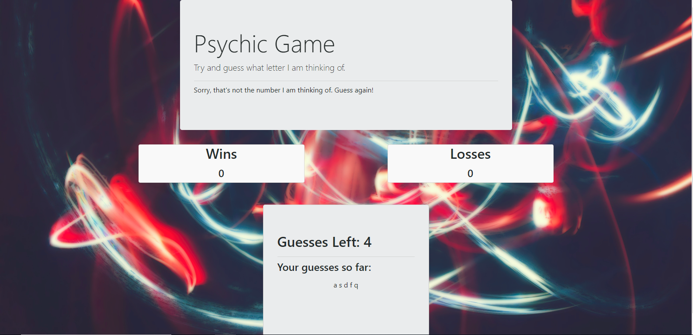

# Psychic-Game
Make a "Psychic Game", where you must guess the number or letter that the computer has chosen.

# Link to Deployed Site
[Psychic-Game](https://aehaq.github.io/Psychic-Game/)

# Images


# Technology Used
- html
- CSS (Bootstrap)
- javascript

# Code Snippets
```
document.onkeyup = function(event) {

  var keyPressed = event.key;

  //checks if keypress is valid letter
  if (cpuPool.indexOf(keyPressed) != -1) {
    
    //checks if letter has been guessed
    if (userPool.indexOf(keyPressed) === -1) {

      //If the guess is incorrect
      if (keyPressed !== cpuChoice) {

        guessTracker = guessTracker + " " + keyPressed;
        trackerCard.textContent = guessTracker;
        guessCount = guessCount - 1;
        guessCard.textContent = guessCount;
        userPool.push(keyPressed)
        messageCard.textContent = incorrectPrompt;

      }

      //If user is out of guesses
      if (guessCount < 1) {
        ...

```
The above code shows the hierarchical structure of the logic used to run the actual game itself. I selected this snippet as it features several key learning points detailed below, including: Commenting Code, using onkey events, using a reset function, editing the html page and more key JavaScript skills.

# Learning Points
- Preparing thorough pseudocode that covers the minutiae of the upcoming project, to make the actual process of writing code easier to manage.
- Commenting throughout your JavaScript to ensure that it is easy to immediately understand the function of your codesnippets.
- Writing a large portion of code within an onkeyup event, so as to make sure changes are applied whenever an action is taken.
- Nesting several layers of if statements to ensure actions are only performed in very specific scenarios.
- Creating a reset function in order to promote DRY style code.
- Using and updating html span tags with the textContent function to keep track of variable data.
- Understanding how non-purposeful ordering of functions can lead to bugs. 
- Debugging method involving placement of 'goal posts' using unique console log messages to track internal processes.

# Author 
Azfar Haq - [GitHub](https://github.com/aehaq)

# License
Standard MIT License